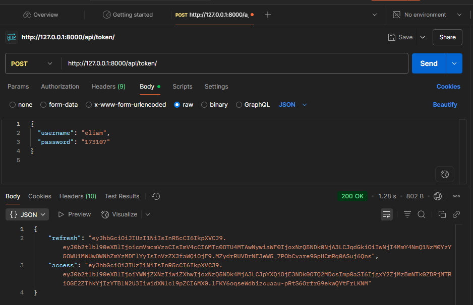
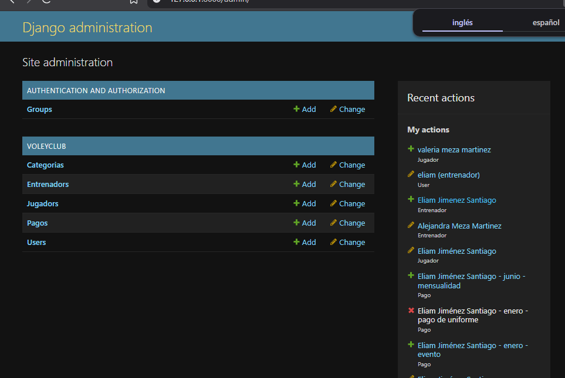
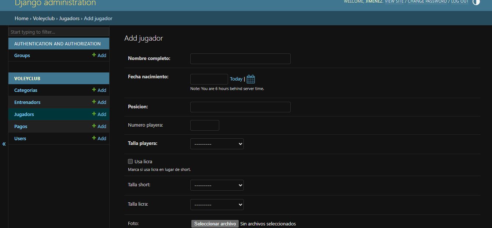
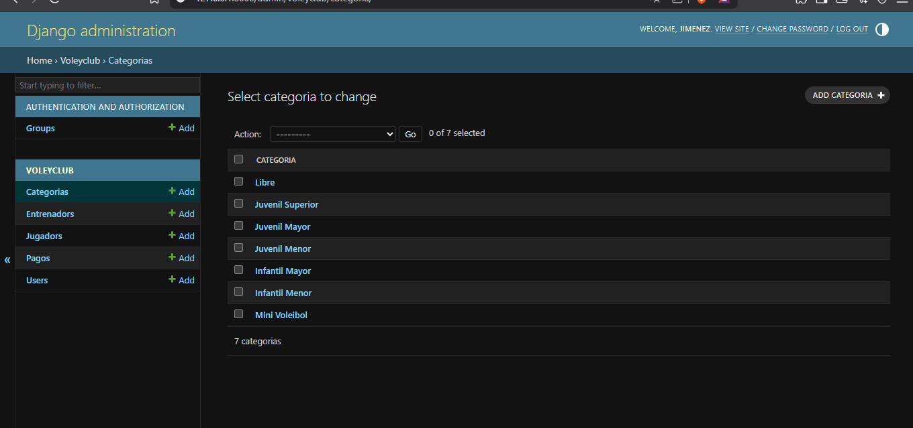

# 🏐 VoleyClub - Backend

Este es el backend de una aplicación de gestión para un club de voleibol. Permite a entrenadores registrar jugadores, administrar pagos, visualizar categorías por edad y llevar control general del equipo.

Construido con **Python**, **Django**, y **Django REST Framework**, expone una API segura mediante **JWT**.

---

## 🌐 Funcionalidades

- ✅ Registro de jugadores con documentos (foto, acta, CURP)
- ✅ División automática por categorías según edad
- ✅ Roles de usuario (admin y entrenador)
- ✅ Registro y consulta de pagos mensuales
- ✅ Visualización de jugadores por entrenador
- ✅ Autenticación segura con JWT
- ✅ Panel admin para control completo

---

## 🚀 Tecnologías utilizadas

- Python 3.11+
- Django 5.2
- Django REST Framework
- Simple JWT
- Django Filter
- SQLite3 (puede cambiarse a PostgreSQL)
- CORS Headers

---

## 🗂️ Estructura del proyecto

```
voleiapp/
│
├── voleyclub/              # App principal
│   ├── models.py           # Modelos (Jugador, Pago, Categoría, Entrenador, Usuario)
│   ├── serializers.py      # Serializadores para DRF
│   ├── views.py            # Vistas y lógica de negocio (ViewSets)
│   ├── urls.py             # Rutas de la app
│
├── voleiapp/               # Configuración principal
│   ├── settings.py         # Configuración del proyecto
│   ├── urls.py             # Rutas globales
│
├── media/                  # Archivos subidos (foto, CURP, acta)
├── db.sqlite3              # Base de datos por defecto
├── manage.py
├── requirements.txt
├── README.md
└── .gitignore
```

---

## ⚙️ Instalación local

```bash
git clone 
cd voleyclub-backend

python -m venv venv
venv\Scripts\activate  # En Windows
# source venv/bin/activate  # En Linux/Mac

pip install -r requirements.txt

python manage.py migrate
python manage.py createsuperuser

python manage.py runserver
```

---

## 🔐 Variables de entorno recomendadas

Crea un archivo `.env` (si lo usas) o configura en `settings.py`:

```env
SECRET_KEY=tu_clave_secreta
DEBUG=True
ALLOWED_HOSTS=127.0.0.1,localhost
```

---

## 🔑 Autenticación

El sistema usa JWT para login seguro:

- Login:  
  `POST /api/token/`  
  ```json
  {
    "username": "eliam",
    "password": "173107"
  }
  ```

- Refresh:  
  `POST /api/token/refresh/`

Guarda el token de acceso (`access`) para futuras peticiones.

---

## 🔄 Endpoints principales

| Método | URL                         | Descripción                        |
|--------|-----------------------------|------------------------------------|
| POST   | `/api/token/`               | Obtener JWT                        |
| GET    | `/api/yo/`                  | Info del usuario logueado          |
| GET    | `/api/jugadores/`           | Lista de jugadores                 |
| POST   | `/api/jugadores/`           | Crear nuevo jugador                |
| GET    | `/api/pagos/`               | Lista de pagos                     |
| POST   | `/api/pagos/`               | Registrar pago                     |
| GET    | `/api/categorias/`          | Lista de categorías                |
| GET    | `/api/jugadores/mis-jugadores/` | Jugadores del entrenador logueado |

---

## 🧪 Probar API con Postman

1. Haz login con `/api/token/`  
2. Copia el `access token`
3. En Postman, en cada petición, agrega un Header:
   ```
   Authorization: Bearer TU_TOKEN
   ```


## 🧼 Buenas prácticas

- Usa entorno virtual
- Mantén `DEBUG=False` en producción
- No subas `db.sqlite3` si usas producción
- Usa `.env` para tus secretos
- Haz commits frecuentes y descriptivos

---

## 📸 Capturas (opcional)









---

## 🧑‍💻 Autor

**Eliam Jiménez Santiago**  
💼 Backend Developer (en formación)  
📍 Coatzacoalcos, Veracruz, México  
📧 eliam1731@hotmail.com  
🌐 LinkedIn: [linkedin.com/in/eliam-jiménez-santiago-1a3244324](https://www.linkedin.com/in/eliam-jim%C3%A9nez-santiago-1a3244324/)

---

## 📝 Licencia

MIT © 2025 Eliam Jiménez Santiago
